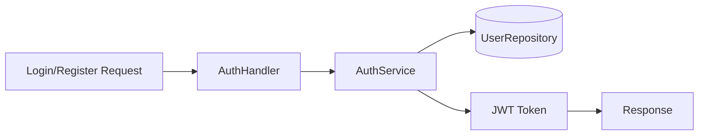

# Server 设计-账号模块

## 类关系
- `AuthHandler` -> `AuthService` -> `UserRepository`

## 流程图

```mermaid
flowchart LR
  A[Login/Register Request] --> B[AuthHandler]
  B --> C[AuthService]
  C --> D[(UserRepository)]
  C --> E[JWT Token]
  E --> F[Response]
```

## 错误处理
- 参数错误：`400 BAD_REQUEST`
- 账号或密码错误：`401 INVALID_CREDENTIALS`
- 邮箱重复：`409 EMAIL_EXISTS`
