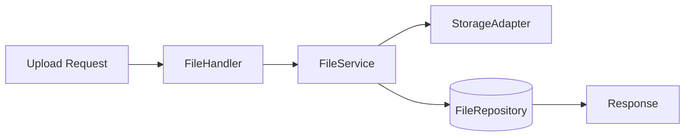

# Server 设计-文件模块

## 类关系
- `FileHandler` -> `FileService` -> `FileRepository`
- `FileService` -> `StorageAdapter`

## 流程图

## 错误处理
- 缺少文件：`400 BAD_REQUEST`
- 非法文件ID：`400 BAD_REQUEST`
- 无权限/非 owner：`404` 或 `403`（按接口定义）
- 存储层异常：统一映射业务错误码
