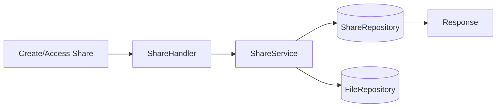

# Server 设计-分享模块

## 类关系
- `ShareHandler` -> `ShareService` -> `ShareRepository`
- `ShareService` -> `FileRepository`

## 流程图

## 错误处理
- 提取码错误：`403 EXTRACT_CODE_INVALID`
- 分享已过期：`410 EXPIRED`
- 分享已取消：`410 REVOKED`
- 分享不存在：`404 NOT_FOUND`
