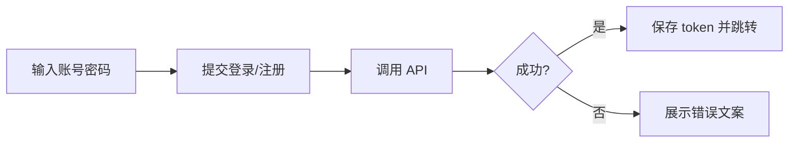

# Web 设计-账号模块

## 类关系
- `AuthPage` -> `apiClient` -> `auth API`
- `AuthPage` -> `token storage`

## 流程图

```mermaid
flowchart LR
  A[输入账号密码] --> B[提交登录/注册]
  B --> C[调用 API]
  C --> D{成功?}
  D -- 是 --> E[保存 token 并跳转]
  D -- 否 --> F[展示错误文案]
```

## 错误处理
- 表单校验错误：前端拦截
- 401：提示账号或密码错误
- 其它错误：统一错误提示
