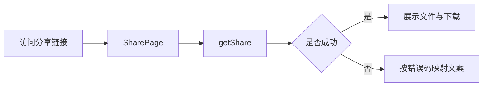

# Web 设计-分享模块

## 类关系
- `SharePage` -> `getShare` / `buildShareDownloadUrlWithCode`
- `SharePage` -> `mapShareErrorMessage`

## 流程图

## 错误处理
- `EXTRACT_CODE_INVALID`：提示输入正确提取码
- `EXPIRED`：提示链接已过期
- `REVOKED`：提示分享已被取消
- `NOT_FOUND`：提示内容不存在
